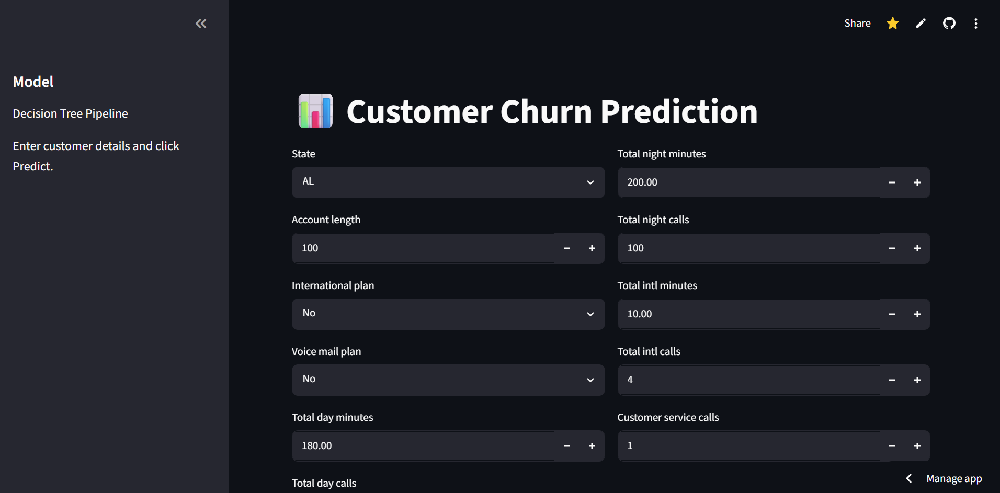
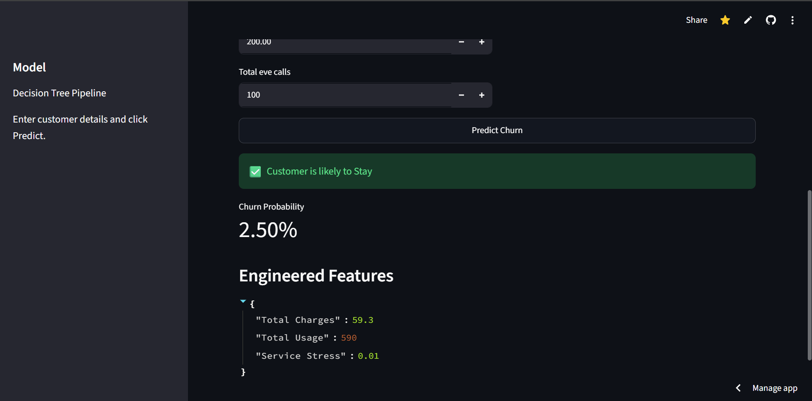

# 📊 Customer Churn Prediction

A Machine Learning web application that predicts whether a telecom customer is likely to churn based on customer profile, service usage, and support interactions.

## 🚀 Live Demo

👉 https://predict-churn-customer.streamlit.app/

---

## 📌 Features

- Predict customer churn instantly
- Interactive Streamlit dashboard
- Automatic feature engineering
- One-hot encoding for categorical features
- Churn probability prediction
- Clean and responsive UI

---

## 🛠 Tech Stack

- Python
- Streamlit
- Scikit-learn
- Pandas
- NumPy
- Joblib

---

## 📂 Dataset

Telecom Customer Churn Dataset

Features include:

- Account Length
- International Plan
- Voice Mail Plan
- Call Minutes
- Call Counts
- Customer Service Calls
- State
- Revenue Segment

---

## 🤖 Machine Learning Pipeline

- Data Cleaning
- Feature Engineering
- One-Hot Encoding
- Standard Scaling
- Decision Tree Classifier

---

## 📸 Application




---

## ⚙️ Installation

```bash
git clone https://github.com/SHASHWATg10/Customer-Churn-Prediction.git

cd Customer-Churn-Prediction

pip install -r requirements.txt

streamlit run app.py
```

---

## 📈 Future Improvements

- SHAP Explainability
- Batch CSV Prediction
- Customer Segmentation Dashboard
- Model Comparison
- Cloud Database Integration

---

## 👨‍💻 Author

Shashwat Gupta